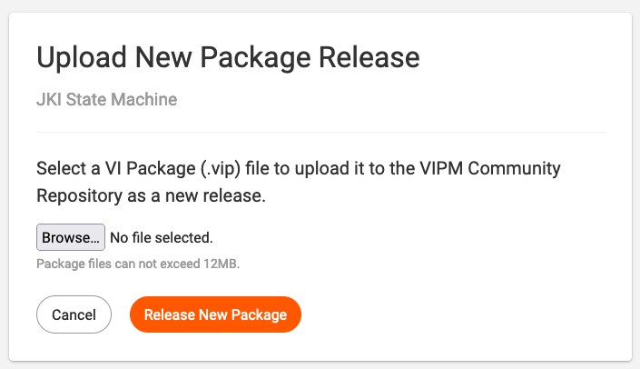

# Publishing Packages

## Submitting New Packages

Have a new package you want to share?

Please visit the [VIPM Community Publishing](https://www.vipm.io/publish/) page to learn more about how to become a package publisher and share your LabVIEW tools with the community.

## Releasing New Versions of Packages

To release a new version of a package, follow these steps below.

### 1. Package Homepage >> Find "New Release" button

Go to your package's homepage on vipm.io and click the upload new release button.

Or, you can go to the [My Published Packages](https://www.vipm.io/publish/my-packages/) page and click the New Release link.

### 2. Upload New Package Release Page >> Upload your Package

On the *Upload New Package Release* page for your package, select your package file and then click the Release New Package button.

### 3. Confirm the Release

After your package finishes uploading, it should be available in [VIPM Desktop](https://www.vipm.io/desktop) and on vipm.io almost immediately (within seconds).

#### Tip: Check your email

You will also receive an email notifying you of the results, whether the release succeeded or had any errors.

If you do not receive an email, please check your spam/junk folder.

If you still do not receive an email, it could mean there was a problem -- if that's the case, please [let us know](https://support.vipm.io).

## My Published Packages page

On your [My Published Packages](https://www.vipm.io/publish/my-packages/) page (as shown below) you can check on the status of newly released packages, release new versions of packages, and view statistics .

