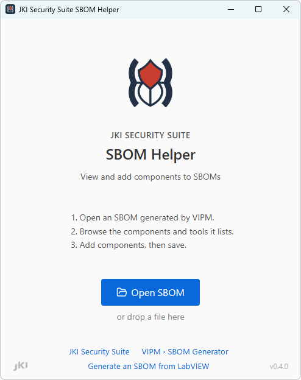
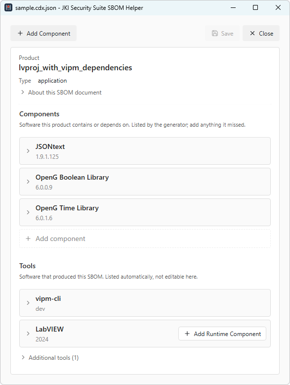
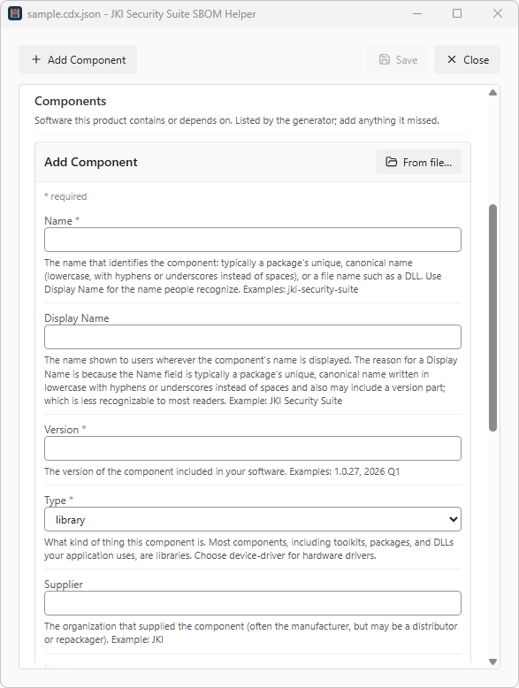

# JKI Security Suite SBOM Helper

The SBOM Helper opens a CycloneDX SBOM generated by VIPM, lets you add and describe the components no scan can discover, and saves a file ready to ship with your product.

[Download the SBOM Helper](https://packages.jki.net/jki-security-suite/release/jki-security-suite-sbom-helper_0.4.0.21_windows_x64.nipkg){ .md-button .md-button--primary }

The download is an NI package. Install it with **NI Package Manager**, which adds the Helper to your Start menu.

!!! info "Prerequisites"
    To run the SBOM Helper:

    - **Windows** — the SBOM Helper is a Windows desktop application
    - **NI Package Manager** — installs the download above

    To generate the SBOMs it edits:

    - **VIPM 2026 Q3** or later
    - **LabVIEW 2026 Q3** or later — to generate from the LabVIEW Application Builder

## Why you need it

`vipm sbom` discovers what the package managers know about: VIPM packages, NI packages, and the dependencies your LabVIEW project links. It cannot discover a DLL you ship alongside your application, a firmware image loaded onto hardware, or a vendor SDK that arrived as a zip file. Those components exist in your SBOM only because a person records them — and a component missing from an SBOM is the one that will not be checked when a vulnerability is announced.

The Helper is where that recording happens, against the SBOM you already generated rather than a second file kept in step by hand.

## What you can do

**Open and review.** Open an SBOM generated by VIPM — or drop the file onto the start screen — and browse what it lists. **Components** are the software your product contains or depends on; **Tools** are the software that produced the SBOM, listed automatically and not edited here. Each row opens to show the facts recorded for it.

**Add a component from a file.** Point the Helper at a file on disk and it reads what the file declares about itself: its product name becomes the display name, its own recorded name becomes the name, and the type follows the extension — `.exe` to application, `.dll` to library, `.sys` to device driver. The file's SHA-256 and MD5 are computed for you. A file with no version information leaves those fields for you to fill.

The file's path is not recorded in the saved SBOM. The hash that identifies it is.

**Add a component by hand.** Type the details yourself for anything you cannot point at — firmware running on a device, a hardware module, a component described by a supplier's paperwork.

**Name**, **Version** and **Type** are required; everything else is optional. Each field explains itself beneath the box, so the form is also the reference for what belongs in it.

Two of them are easy to confuse, and the distinction is worth knowing before you start:

- **Name** is the component's canonical identifier — the unique name a package ecosystem or a file uses, often lowercase with hyphens, such as `jki-security-suite` or a DLL's own file name.
- **Display Name** is the name a person recognises, such as `JKI Security Suite`. It is what the components list shows as the row's title.

Beyond those, you can record a supplier, a license, a download URL and a description, and — under **Advanced** — SHA-256 and MD5 hashes and a Package URL.

**Edit what you added.** Components the Helper added can be edited or deleted. Name, version, type, supplier, license, download URL, description, and purl are yours to change.

**Add a runtime that something deploys with.** When the SBOM lists software that ships with a runtime the SBOM does not yet list, that row offers **Add Runtime Component** — LabVIEW and the LabVIEW Runtime, or an NI-DAQmx support package and the NI-DAQmx Runtime. The details come from your local NI feed: the runtime's exact version, NI's display name and description, its supplier, SHA-256, download location, and its own `pkg:nipkg` Package URL, all shown for review before anything is added.

This matters more than it looks. The runtime is what your application actually loads on a customer's machine, and it is the component most likely to carry a published vulnerability — yet nothing in the project file mentions it, so no scan can find it.

## A note on Package URLs

The Helper does not invent a Package URL. The `purl` field starts empty and is saved exactly as typed, because a purl asserts that a component can be found in a package ecosystem — and a purl that resolves to nothing is worse than no purl at all. When a component genuinely comes from an ecosystem, type its purl; when it does not, leave the field empty.

A runtime added from the NI feed brings that package's own purl, which is a real one.

## Hashes

`SHA-256` and `MD5` under **Advanced** are filled in automatically when you add a component from a file, and can be typed or pasted otherwise.

Each field expects a whole hexadecimal digest. Paste a truncated value, a `sha256:` prefix, or a line of output from a checksum tool and the field says what it expects; Add and Apply wait until it is a digest.

## Next steps

- **[Custom Components](custom-components.md)** — the full workflow, and the file-based alternative for automated builds
- **[SBOM Overview](index.md)** — what `vipm sbom` generates and how to generate it
- **[Output Reference](output-reference.md)** — the CycloneDX fields the SBOM contains

--8<-- "need-help.md"
